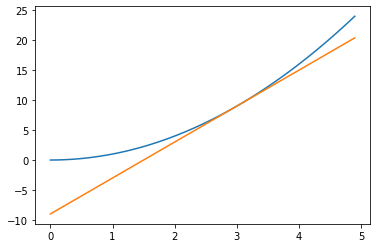
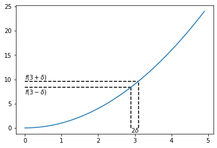

# Part 3

## 1. Decorator
Consider a mathematical function of a variable $f(x)$. The derivative of the function is a measure of change, illustrated by the slope of a tangent line at a point on the curve

For example given

$$ f(x) = x^2 $$

the derivative is

$$ f'(x) = 2x $$

which means that at e.g. $x_0=3$ a tangent to the curve has slope $f'(3) = 2*3=6$ and has the equation for a straight line

$$ y = f(x_0) + f'(x_0)(x-x_0)$$


```python
import math

import matplotlib.pyplot as plt
import numpy as np
```


```python
def f(x):
    return x**2

def fp(x):
    return 2*x

x = np.arange(0, 5, .1)
x0 = 3.0

plt.plot(x, f(x))
plt.plot(x, f(x0) + fp(x0)*(x-x0))
```


    [<matplotlib.lines.Line2D at 0x7f97d37c4d30>]





Mathematically derivatives are understood as the ratio of differences in y and x values close to a given point and taking the limit where the point get closer

$$ f'(x) \approx \frac{f(x + \delta) - f(x-\delta)}{2\delta} $$

For a small number $\delta$ this can be used as an approximation to the derivate for a function


```python
delta = 0.1

plt.vlines(x0-delta, 0, f(x0-delta), linestyle='dashed')
plt.vlines(x0+delta, 0, f(x0+delta), linestyle='dashed')
plt.hlines(f(x0-delta), 0, x0-delta, linestyle='dashed')
plt.hlines(f(x0+delta), 0, x0+delta, linestyle='dashed')

plt.text(2.9, -1, '$2\delta$')
plt.text(0, 10, '$f(3 + \delta)$')
plt.text(0, 7, '$f(3 -\delta)$')


plt.plot(x, f(x))
#plt.plot(dx, f(dx))
```


    [<matplotlib.lines.Line2D at 0x7f97d378fb50>]





### Task

Write a decorator that implements the numerical approximattion to a derivative

The decorator applied to a library function, e.g. math.sin should then return a function for which approximately

    derivative(math.sin)(x) ≈ math.cos(x)

for most values of $x$

Likewise the decorator applied to a function definition with the @-syntax

~~~
@derivative
def f(x):
     return x**2
~~~

defines a function that satisfies

    f(x) ≈ 2*x
    
for most values of $x$

### Solution

A Python decorator takes a function as input and returns a function as output.
We accomplish this by defining an inner function that does the differentiation
~~~
    def wrap(x):
        return (f(x + delta) - f(x-delta))/(2*delta)
~~~
A detail we may note here that `x` is a variable with some value that is input to
the function. `f` and `delta` however are names that are not defined locally,
Python tries to make sense of them by looking in the global context where the
function is defined. If we would look closer at the function object defined as
`wrap` we would find them in the `__globals__` attribute of the function, a
dictionary

A full solution is then

```python
>>> delta = 1e-8

>>> def derivative(f):
...     def wrap(x):
...         return (f(x + delta) - f(x-delta))/(2*delta)
...     return wrap

```

which is verified by the tests

```python
epsilon = 1e-6

@derivative
def f(x):
    return x**2

assert abs(f(3.0) - 6.0) < epsilon
```


```python
assert abs(derivative(math.sin)(.5) - math.cos(.5)) < epsilon
assert abs(derivative(math.log)(3.0) - 1/3.0) < epsilon
assert abs(derivative(math.exp)(1.0) - math.exp(1.0)) < epsilon
assert abs(derivative(math.atan)(17.0) - 1/(1 + 17.0**2)) < epsilon
```

## 2. Generator


This is a filter that returns lines of a file that have a length greader than maximum

If the content of a textfile `file.txt` is

~~~
hello 
you
merry
~~~

We except a function `find_long_lines` to behave like this

~~~
>>> for line in find_long_lines('file.txt', 3): # doctest: +SKIP
...    print(line)
hello
merry
~~~

Knowing that the return value of the function must be iterable to use in a for-loop. 
Implement this function as a generator.

The max_length should be without the final newline character `\n` of the line 

### Solution

The generator is most easily defined as a function definition containing the
`yield` statement

When we loop over lines in a file, we get lines with a final newline character,
which can be removed with the `strip` method for strings.


```python
>>> def find_long_lines(filename, max_length):
...     for l in open(filename):
...         line = l.strip()
...         if len(line) >  max_length:
...             yield line

```


```python
%%file file.txt
hello
you
merry
```

```python
>>> assert list(find_long_lines('file.txt', 3)) == ['hello', 'merry']

```

A final test that was not visible is to verify that the implementation
was in fact a generator

```python
>>> from typing import Generator
>>> assert isinstance(find_long_lines('foo', 7), Generator)

```
